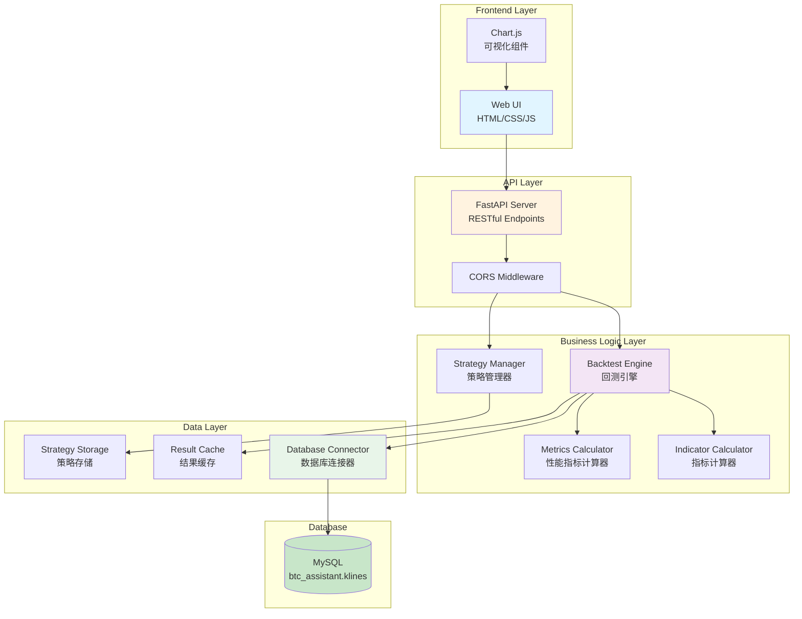
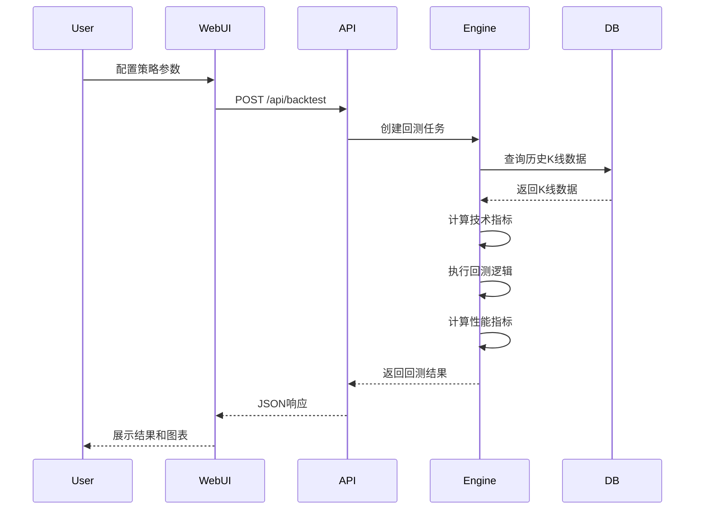

# Design Document: BTC回测系统

## Overview

BTC回测系统是一个基于历史数据的量化交易策略回测平台，采用Python FastAPI后端和Vanilla JavaScript前端架构。系统的核心功能是允许用户通过Web界面配置技术指标组合策略，并使用MySQL数据库中的历史K线数据进行回测，生成详细的性能报告和可视化图表。

### 系统目标

1. **策略灵活性**: 支持用户自定义技术指标组合、开仓条件和止盈止损规则
2. **多时间周期**: 支持月线(1m)、周线(1w)、日线(1d)、4小时(4h)四种时间周期
3. **准确性**: 基于真实历史数据进行回测，确保结果的可靠性
4. **性能**: 快速完成回测计算，支持并发请求
5. **易用性**: 提供直观的Web界面和详细的回测报告

### 技术栈

- **后端**: Python 3.9+, FastAPI, MySQL Connector, Pandas, NumPy
- **前端**: HTML5, CSS3, Vanilla JavaScript (ES6), Chart.js
- **数据库**: MySQL 8.0+ (已有btc_assistant.klines表)
- **部署**: Uvicorn (ASGI服务器)

### 系统边界

**包含范围**:
- 策略配置管理（创建、保存、加载）
- 回测引擎（开仓/平仓逻辑、持仓管理）
- 技术指标计算（EMA、RSI、MACD、布林带、ATR）
- 性能指标计算（收益率、胜率、最大回撤、夏普比率）
- Web UI（策略配置表单、结果展示、图表可视化）
- RESTful API端点

**不包含范围**:
- 实时交易执行
- 交易所API集成
- 用户认证和权限管理
- 策略优化和参数扫描
- 机器学习模型集成

## Architecture

### 系统架构图



### 架构模式

系统采用**分层架构**模式，具有以下特点：

1. **表示层（Frontend Layer）**: 负责用户交互和数据展示
2. **API层（API Layer）**: 提供RESTful接口，处理HTTP请求/响应
3. **业务逻辑层（Business Logic Layer）**: 实现核心回测逻辑和计算
4. **数据层（Data Layer）**: 管理数据访问和持久化

### 数据流



## Components and Interfaces

### 1. Backtest Engine (回测引擎)

**职责**: 执行策略回测的核心组件，管理持仓状态和交易记录。

**接口**:

```python
class BacktestEngine:
    def __init__(self, strategy_config: StrategyConfig, kline_data: pd.DataFrame):
        """初始化回测引擎"""
        
    def run(self) -> BacktestResult:
        """执行回测，返回回测结果"""
        
    def _evaluate_entry_conditions(self, row: pd.Series) -> bool:
        """评估开仓条件"""
        
    def _evaluate_exit_conditions(self, row: pd.Series, position: Position) -> tuple[bool, str]:
        """评估平仓条件，返回(是否平仓, 平仓原因)"""
        
    def _open_position(self, row: pd.Series) -> Position:
        """开仓"""
        
    def _close_position(self, position: Position, row: pd.Series, reason: str) -> TradeRecord:
        """平仓"""
        
    def _calculate_pnl(self, position: Position, current_price: float) -> tuple[float, float]:
        """计算当前盈亏，返回(绝对值, 百分比)"""
```

**关键算法**:

1. **时间序列迭代**: 按时间顺序遍历K线数据
2. **条件评估**: 使用逻辑运算符组合多个指标条件
3. **持仓管理**: 跟踪开仓状态，计算实时盈亏
4. **止盈止损**: 优先评估绝对值止损，再评估指标止损

### 2. Strategy Manager (策略管理器)

**职责**: 管理策略配置的创建、验证、保存和加载。

**接口**:

```python
class StrategyManager:
    def validate_config(self, config: dict) -> tuple[bool, list[str]]:
        """验证策略配置，返回(是否有效, 错误列表)"""
        
    def save_strategy(self, name: str, config: StrategyConfig) -> str:
        """保存策略，返回策略ID"""
        
    def load_strategy(self, strategy_id: str) -> StrategyConfig:
        """加载策略"""
        
    def list_strategies(self) -> list[dict]:
        """列出所有已保存的策略"""
        
    def delete_strategy(self, strategy_id: str) -> bool:
        """删除策略"""
        
    def get_templates(self) -> list[StrategyConfig]:
        """获取预定义策略模板"""
```

### 3. Indicator Calculator (指标计算器)

**职责**: 计算各种技术指标。

**接口**:

```python
class IndicatorCalculator:
    @staticmethod
    def calculate_ema(prices: pd.Series, period: int) -> pd.Series:
        """计算EMA: EMA_today = (Price * K) + (EMA_yesterday * (1-K)), K = 2/(N+1)"""
        
    @staticmethod
    def calculate_rsi(prices: pd.Series, period: int) -> pd.Series:
        """计算RSI: RSI = 100 - (100 / (1 + RS)), RS = Avg_Gain / Avg_Loss"""
        
    @staticmethod
    def calculate_macd(prices: pd.Series) -> tuple[pd.Series, pd.Series, pd.Series]:
        """计算MACD: DIF = EMA12 - EMA26, DEA = EMA9(DIF), MACD = DIF - DEA"""
        
    @staticmethod
    def calculate_bollinger_bands(prices: pd.Series, period: int = 20, std_dev: float = 2.0) -> tuple[pd.Series, pd.Series, pd.Series]:
        """计算布林带: Middle = SMA20, Upper = Middle + 2*StdDev, Lower = Middle - 2*StdDev"""
        
    @staticmethod
    def calculate_atr(high: pd.Series, low: pd.Series, close: pd.Series, period: int = 14) -> pd.Series:
        """计算ATR: ATR = EMA14(True_Range)"""
        
    def calculate_all_indicators(self, df: pd.DataFrame) -> pd.DataFrame:
        """计算所有指标并添加到DataFrame"""
```

**实现细节**:
- 使用Pandas进行向量化计算以提高性能
- 处理数据不足的情况（返回NaN）
- 缓存计算结果避免重复计算

### 4. Database Connector (数据库连接器)

**职责**: 从MySQL数据库读取历史K线数据。

**接口**:

```python
class DatabaseConnector:
    def __init__(self, db_config: dict):
        """初始化数据库连接"""
        
    def fetch_klines(self, symbol: str, timeframe: str, start_date: datetime, end_date: datetime) -> pd.DataFrame:
        """查询K线数据"""
        
    def validate_data_integrity(self, df: pd.DataFrame) -> list[str]:
        """验证数据完整性，返回警告列表"""
        
    def get_available_date_range(self, symbol: str, timeframe: str) -> tuple[datetime, datetime]:
        """获取可用数据的日期范围"""
```

**数据验证规则**:
1. 检查时间序列连续性（缺失时间戳）
2. 验证OHLC约束: `low <= open, close <= high`
3. 验证成交量非负
4. 记录数据质量警告

### 5. Metrics Calculator (性能指标计算器)

**职责**: 计算回测性能指标。

**接口**:

```python
class MetricsCalculator:
    def __init__(self, trades: list[TradeRecord], initial_capital: float):
        """初始化指标计算器"""
        
    def calculate_total_return(self) -> float:
        """总收益率 = (final_capital - initial_capital) / initial_capital"""
        
    def calculate_win_rate(self) -> float:
        """胜率 = winning_trades / total_trades"""
        
    def calculate_max_drawdown(self, equity_curve: pd.Series) -> float:
        """最大回撤 = max(peak - trough) / peak"""
        
    def calculate_sharpe_ratio(self, returns: pd.Series, risk_free_rate: float = 0.0) -> float:
        """夏普比率 = (mean_return - risk_free_rate) / std_return"""
        
    def calculate_profit_factor(self) -> float:
        """盈亏比 = total_profit / total_loss"""
        
    def calculate_all_metrics(self) -> PerformanceMetrics:
        """计算所有性能指标"""
```

### 6. API Server (FastAPI服务器)

**职责**: 提供RESTful API端点。

**端点设计**:

```python
# 回测相关
POST   /api/backtest              # 执行回测
GET    /api/backtest/{id}/status  # 查询回测状态
GET    /api/backtest/{id}/results # 获取回测结果
GET    /api/backtest/{id}/report  # 生成回测报告

# 策略管理
POST   /api/strategies            # 保存策略
GET    /api/strategies            # 列出所有策略
GET    /api/strategies/{id}       # 获取特定策略
DELETE /api/strategies/{id}       # 删除策略
GET    /api/strategy-templates    # 获取策略模板

# 元数据
GET    /api/indicators            # 获取可用指标列表
GET    /api/timeframes            # 获取可用时间周期
GET    /api/data-range            # 获取数据可用范围
```

### 7. Web UI Components

**组件结构**:

```
web/
├── backtest.html          # 回测主页面
├── backtest.css           # 样式文件
├── backtest.js            # 主逻辑
└── components/
    ├── StrategyForm.js    # 策略配置表单组件
    ├── ResultsPanel.js    # 结果展示面板组件
    ├── TradeTable.js      # 交易记录表格组件
    ├── ChartRenderer.js   # 图表渲染组件
    └── TemplateSelector.js # 模板选择器组件
```

**关键UI组件**:

1. **StrategyForm**: 动态表单，支持添加/删除指标条件
2. **ResultsPanel**: 展示性能指标摘要卡片
3. **TradeTable**: 可排序、可过滤的交易记录表格
4. **ChartRenderer**: 使用Chart.js渲染权益曲线、回撤图、月度收益热力图

## Data Models

### StrategyConfig (策略配置)

```python
from dataclasses import dataclass
from typing import List, Literal
from enum import Enum

class LogicOperator(Enum):
    AND = "AND"
    OR = "OR"

class ComparisonOperator(Enum):
    GT = ">"      # 大于
    LT = "<"      # 小于
    GTE = ">="    # 大于等于
    LTE = "<="    # 小于等于
    EQ = "=="     # 等于
    RANGE = "range"  # 范围内

@dataclass
class IndicatorCondition:
    """指标条件"""
    indicator: str              # 指标名称: "EMA7", "RSI14", "MACD_DIF", etc.
    operator: ComparisonOperator
    value: float | tuple[float, float]  # 单值或范围(min, max)
    timeframe: str = "1d"       # 时间周期

@dataclass
class EntryConditions:
    """开仓条件"""
    conditions: List[IndicatorCondition]
    logic_operator: LogicOperator = LogicOperator.AND

@dataclass
class ExitConditions:
    """平仓条件"""
    indicator_conditions: List[IndicatorCondition]  # 基于指标的平仓条件
    take_profit_amount: float | None = None         # 止盈金额
    stop_loss_amount: float | None = None           # 止损金额
    take_profit_pct: float | None = None            # 止盈百分比
    stop_loss_pct: float | None = None              # 止损百分比
    logic_operator: LogicOperator = LogicOperator.OR  # 任一条件触发即平仓

@dataclass
class StrategyConfig:
    """策略配置"""
    name: str
    description: str
    timeframe: str                    # 主时间周期
    position_direction: Literal["long", "short"]
    position_size_type: Literal["amount", "percentage"]
    position_size_value: float
    entry_conditions: EntryConditions
    exit_conditions: ExitConditions
    initial_capital: float = 100000.0
    allow_multiple_positions: bool = False
```

### Position (持仓)

```python
@dataclass
class Position:
    """持仓信息"""
    entry_time: datetime
    entry_price: float
    position_size: float            # 持仓数量（BTC数量）
    position_value: float           # 持仓价值（USDT）
    direction: Literal["long", "short"]
    entry_capital: float            # 开仓时使用的资金
```

### TradeRecord (交易记录)

```python
@dataclass
class TradeRecord:
    """交易记录"""
    trade_id: int
    entry_time: datetime
    entry_price: float
    exit_time: datetime
    exit_price: float
    position_size: float
    direction: Literal["long", "short"]
    profit_loss: float              # 盈亏金额
    profit_loss_pct: float          # 盈亏百分比
    holding_period: timedelta       # 持仓时长
    exit_reason: str                # 平仓原因
    entry_capital: float            # 开仓资金
```

### PerformanceMetrics (性能指标)

```python
@dataclass
class PerformanceMetrics:
    """性能指标"""
    initial_capital: float
    final_capital: float
    total_return: float             # 总收益率
    total_return_pct: float         # 总收益率百分比
    
    total_trades: int
    winning_trades: int
    losing_trades: int
    win_rate: float                 # 胜率
    
    avg_profit: float               # 平均盈利
    avg_loss: float                 # 平均亏损
    profit_factor: float            # 盈亏比
    
    max_drawdown: float             # 最大回撤
    max_drawdown_pct: float         # 最大回撤百分比
    
    sharpe_ratio: float             # 夏普比率
    
    longest_win_streak: int         # 最长连胜
    longest_loss_streak: int        # 最长连亏
    
    total_fees: float = 0.0         # 总手续费（暂不实现）
```

### BacktestResult (回测结果)

```python
@dataclass
class BacktestResult:
    """回测结果"""
    backtest_id: str
    strategy_config: StrategyConfig
    start_date: datetime
    end_date: datetime
    trades: List[TradeRecord]
    metrics: PerformanceMetrics
    equity_curve: pd.DataFrame      # 权益曲线 (timestamp, capital)
    data_quality_warnings: List[str]
    execution_time: float           # 执行时间（秒）
```

### 数据库Schema扩展

现有的`klines`表已包含OHLCV数据和部分技术指标。需要添加以下表：

```sql
-- 策略配置表
CREATE TABLE IF NOT EXISTS `backtest_strategies` (
    `id` VARCHAR(36) PRIMARY KEY,
    `name` VARCHAR(100) NOT NULL,
    `description` TEXT,
    `config_json` JSON NOT NULL,
    `created_at` TIMESTAMP DEFAULT CURRENT_TIMESTAMP,
    `updated_at` TIMESTAMP DEFAULT CURRENT_TIMESTAMP ON UPDATE CURRENT_TIMESTAMP,
    INDEX `idx_name` (`name`),
    INDEX `idx_created` (`created_at`)
) ENGINE=InnoDB DEFAULT CHARSET=utf8mb4;

-- 回测结果表（可选，用于缓存）
CREATE TABLE IF NOT EXISTS `backtest_results` (
    `id` VARCHAR(36) PRIMARY KEY,
    `strategy_id` VARCHAR(36),
    `start_date` DATETIME NOT NULL,
    `end_date` DATETIME NOT NULL,
    `result_json` JSON NOT NULL,
    `created_at` TIMESTAMP DEFAULT CURRENT_TIMESTAMP,
    `expires_at` TIMESTAMP,
    INDEX `idx_strategy` (`strategy_id`),
    INDEX `idx_expires` (`expires_at`)
) ENGINE=InnoDB DEFAULT CHARSET=utf8mb4;
```

## Error Handling

### 错误分类

1. **用户输入错误** (HTTP 400)
   - 策略配置验证失败
   - 无效的日期范围
   - 无效的指标名称或参数

2. **数据错误** (HTTP 404/422)
   - 请求的数据不存在
   - 数据质量问题（缺失、异常值）

3. **系统错误** (HTTP 500)
   - 数据库连接失败
   - 回测引擎内部错误
   - 计算溢出或异常

4. **资源限制错误** (HTTP 429/503)
   - 并发请求过多
   - 回测队列已满

### 错误处理策略

```python
class BacktestError(Exception):
    """回测基础异常"""
    pass

class ValidationError(BacktestError):
    """验证错误"""
    pass

class DataError(BacktestError):
    """数据错误"""
    pass

class CalculationError(BacktestError):
    """计算错误"""
    pass

# API错误处理
@app.exception_handler(ValidationError)
async def validation_error_handler(request: Request, exc: ValidationError):
    return JSONResponse(
        status_code=400,
        content={"error": "Validation Error", "detail": str(exc)}
    )

@app.exception_handler(DataError)
async def data_error_handler(request: Request, exc: DataError):
    return JSONResponse(
        status_code=422,
        content={"error": "Data Error", "detail": str(exc)}
    )

@app.exception_handler(Exception)
async def general_error_handler(request: Request, exc: Exception):
    logger.error(f"Unhandled exception: {exc}", exc_info=True)
    return JSONResponse(
        status_code=500,
        content={"error": "Internal Server Error", "detail": "An unexpected error occurred"}
    )
```

### 日志记录

```python
import logging
from logging.handlers import RotatingFileHandler

# 配置日志
logger = logging.getLogger("backtest")
logger.setLevel(logging.DEBUG)

# 控制台处理器
console_handler = logging.StreamHandler()
console_handler.setLevel(logging.INFO)
console_formatter = logging.Formatter('%(asctime)s [%(levelname)s] %(message)s')
console_handler.setFormatter(console_formatter)

# 文件处理器（轮转）
file_handler = RotatingFileHandler(
    'logs/backtest.log',
    maxBytes=10*1024*1024,  # 10MB
    backupCount=5
)
file_handler.setLevel(logging.DEBUG)
file_formatter = logging.Formatter('%(asctime)s [%(levelname)s] %(name)s - %(message)s')
file_handler.setFormatter(file_formatter)

logger.addHandler(console_handler)
logger.addHandler(file_handler)
```

**日志记录点**:
- 所有API请求（endpoint, parameters, client_ip）
- 回测开始和完成（strategy_id, duration）
- 数据质量警告
- 错误和异常（完整堆栈跟踪）
- 性能指标（查询时间、计算时间）

## Correctness Properties

*A property is a characteristic or behavior that should hold true across all valid executions of a system—essentially, a formal statement about what the system should do. Properties serve as the bridge between human-readable specifications and machine-verifiable correctness guarantees.*

### Property Reflection

After analyzing all acceptance criteria, I identified the following redundancies and consolidations:

**Redundancies Eliminated:**
1. Trade record field requirements (8.1, 8.2, 8.3, 8.4, 8.5) can be consolidated into a single comprehensive property about trade record completeness
2. Position field requirements (2.4) and trade record requirements overlap - consolidated into data completeness properties
3. Multiple metric calculation properties (7.1-7.8) can be grouped by calculation type
4. Data validation properties (13.3, 13.5) can be combined into a single OHLC validation property
5. Exit condition evaluation (3.2) is implied by exit triggering (3.3) - consolidated

**Properties Retained:**
- Core business logic properties (entry/exit signals, position management)
- Calculation correctness properties (indicators, metrics)
- Data integrity properties (validation, sorting)
- System behavior properties (error handling, ordering)

### Property 1: Strategy Configuration Validation

*For any* strategy configuration object, validation SHALL pass if and only if all required fields (name, timeframe, position_direction, entry_conditions, exit_conditions) are present and have valid values.

**Validates: Requirements 1.5**

### Property 2: Entry Signal Generation

*For any* set of indicator conditions and market data where all conditions are satisfied according to the specified logic operator (AND/OR), an entry signal SHALL be generated.

**Validates: Requirements 2.1, 2.2**

### Property 3: Position Creation on Entry Signal

*For any* entry signal generated when no position exists and capital is sufficient, a new Position SHALL be created with all required fields (entry_time, entry_price, position_size, direction) populated correctly.

**Validates: Requirements 2.3, 2.4**

### Property 4: Capital Insufficiency Handling

*For any* entry signal where available capital is less than the required position size, the signal SHALL be skipped and no position SHALL be created.

**Validates: Requirements 2.7**

### Property 5: Multi-Timeframe Data Alignment

*For any* strategy using multiple timeframes, data from different timeframes SHALL be aligned by timestamp before condition evaluation.

**Validates: Requirements 2.5**

### Property 6: Exit Condition Triggering

*For any* open position where exit conditions are met (either indicator-based or absolute value-based), the position SHALL be closed and a complete Trade_Record SHALL be created.

**Validates: Requirements 3.2, 3.3, 3.5**

### Property 7: OR Logic for Exit Conditions

*For any* set of exit conditions combined with OR logic, if any single condition is satisfied, the position SHALL be closed.

**Validates: Requirements 3.4**

### Property 8: Profit/Loss Calculation Accuracy

*For any* open position and current market price, the calculated profit/loss (both absolute and percentage) SHALL accurately reflect the difference between current value and entry value, accounting for position direction (long/short).

**Validates: Requirements 4.5**

### Property 9: Take Profit Triggering

*For any* position where profit reaches or exceeds the configured take profit threshold (either absolute amount or percentage), the position SHALL be closed with exit_reason indicating "take_profit_amount" or "take_profit_percentage".

**Validates: Requirements 4.6**

### Property 10: Stop Loss Triggering

*For any* position where loss reaches or exceeds the configured stop loss threshold (either absolute amount or percentage), the position SHALL be closed with exit_reason indicating "stop_loss_amount" or "stop_loss_percentage".

**Validates: Requirements 4.7**

### Property 11: Stop Condition Evaluation Priority

*For any* position with both absolute value stop conditions and indicator-based stop conditions, absolute value conditions SHALL be evaluated before indicator-based conditions.

**Validates: Requirements 4.8**

### Property 12: Data Sorting Guarantee

*For any* query result from the Database_Connector, K-line data SHALL be sorted by timestamp in ascending chronological order.

**Validates: Requirements 5.5**

### Property 13: Missing Data Error Reporting

*For any* query requesting data that does not exist in the database, the Database_Connector SHALL return an error message indicating the missing data range.

**Validates: Requirements 5.6**

### Property 14: Chronological Iteration

*For any* backtest execution, the Backtest_Engine SHALL iterate through historical K-line data in chronological order (ascending timestamp).

**Validates: Requirements 6.1**

### Property 15: Capital Balance Maintenance

*For any* sequence of trades during a backtest, the capital balance SHALL be updated correctly after each trade, with final_capital = initial_capital + sum(all_trade_pnl).

**Validates: Requirements 6.2**

### Property 16: Trade Record Completeness

*For any* completed trade, the Trade_Record SHALL include all required fields: entry_time, entry_price, exit_time, exit_price, position_size, direction, profit_loss (absolute), profit_loss_pct, holding_period, and exit_reason.

**Validates: Requirements 8.1, 8.2, 8.3, 8.4, 8.5**

### Property 17: Trade Record Chronological Ordering

*For any* backtest result, all Trade_Records SHALL be ordered chronologically by entry_time in ascending order.

**Validates: Requirements 8.6**

### Property 18: Backtest Result Completeness

*For any* completed backtest, the BacktestResult SHALL contain all required components: strategy_config, trades list, performance_metrics, equity_curve, and data_quality_warnings.

**Validates: Requirements 6.7, 11.4**

### Property 19: Total Return Calculation

*For any* backtest with initial_capital and final_capital, total_return SHALL equal (final_capital - initial_capital) / initial_capital.

**Validates: Requirements 7.1**

### Property 20: Win Rate Calculation

*For any* set of trades, win_rate SHALL equal (number_of_winning_trades / total_number_of_trades), where a winning trade has profit_loss > 0.

**Validates: Requirements 7.2**

### Property 21: Maximum Drawdown Calculation

*For any* equity curve, maximum_drawdown SHALL equal the largest peak-to-trough decline, calculated as max((peak_value - trough_value) / peak_value) across all peaks.

**Validates: Requirements 7.3**

### Property 22: Sharpe Ratio Calculation

*For any* series of returns, Sharpe_ratio SHALL equal (mean_return - risk_free_rate) / std_deviation_of_returns, with risk_free_rate = 0.

**Validates: Requirements 7.4**

### Property 23: Profit Factor Calculation

*For any* set of trades with at least one profit and one loss, profit_factor SHALL equal (sum_of_all_profits / abs(sum_of_all_losses)).

**Validates: Requirements 7.6**

### Property 24: Trade Count Accuracy

*For any* set of trades, total_trades SHALL equal winning_trades + losing_trades, where winning_trades have profit_loss > 0 and losing_trades have profit_loss < 0.

**Validates: Requirements 7.7**

### Property 25: Winning/Losing Streak Calculation

*For any* chronologically ordered sequence of trades, longest_win_streak SHALL equal the maximum consecutive count of winning trades, and longest_loss_streak SHALL equal the maximum consecutive count of losing trades.

**Validates: Requirements 7.8**

### Property 26: OHLC Data Validation

*For any* K-line data record, the OHLC values SHALL satisfy the constraints: low <= open, low <= close, open <= high, close <= high, and volume >= 0.

**Validates: Requirements 13.3, 13.5**

### Property 27: Missing Timestamp Detection

*For any* time series of K-line data with a specified timeframe, gaps in the timestamp sequence SHALL be detected and reported as data quality warnings.

**Validates: Requirements 13.1, 13.2**

### Property 28: Invalid Data Exclusion

*For any* K-line data that violates OHLC constraints, the invalid record SHALL be excluded from the dataset and an error SHALL be logged.

**Validates: Requirements 13.4**

### Property 29: Data Quality Warning Propagation

*For any* backtest where data quality issues are detected, the BacktestResult SHALL include a data_quality_warnings field containing descriptions of all issues found.

**Validates: Requirements 13.6**

### Property 30: API Validation Behavior

*For any* backtest request received by the API server, if the Strategy_Config is invalid, the server SHALL return an HTTP 400 error with validation error details; if valid, the server SHALL invoke the Backtest_Engine.

**Validates: Requirements 11.2, 11.5**

### Property 31: EMA Calculation Formula

*For any* price series and period N, EMA SHALL be calculated using the formula: EMA_today = (Price_today * K) + (EMA_yesterday * (1 - K)), where K = 2 / (N + 1).

**Validates: Requirements 18.1**

### Property 32: RSI Calculation Formula

*For any* price series and period N, RSI SHALL be calculated using the formula: RSI = 100 - (100 / (1 + RS)), where RS = Average_Gain / Average_Loss over N periods.

**Validates: Requirements 18.2**

### Property 33: MACD Calculation Formula

*For any* price series, MACD components SHALL be calculated as: DIF = EMA12 - EMA26, DEA = EMA9(DIF), MACD_Histogram = DIF - DEA.

**Validates: Requirements 18.3**

### Property 34: Bollinger Bands Calculation Formula

*For any* price series and period N, Bollinger Bands SHALL be calculated as: Middle = SMA(N), Upper = Middle + (2 * StdDev), Lower = Middle - (2 * StdDev).

**Validates: Requirements 18.4**

### Property 35: ATR Calculation Formula

*For any* OHLC series and period N, ATR SHALL be calculated as: ATR = EMA(N, True_Range), where True_Range = max(High - Low, abs(High - Previous_Close), abs(Low - Previous_Close)).

**Validates: Requirements 18.5**

### Property 36: Insufficient Data Handling

*For any* indicator calculation where the available data length is less than the required period, the calculation SHALL be skipped and the indicator value SHALL be NaN until sufficient data is available.

**Validates: Requirements 18.6**

## Testing Strategy

本系统的测试策略采用**双重测试方法**：单元测试（Unit Tests）和属性测试（Property-Based Tests）。

### 单元测试

单元测试用于验证特定示例、边界条件和错误处理。

**测试框架**: pytest

**测试覆盖范围**:

1. **指标计算测试** (`tests/test_indicators.py`)
   - 使用已知输入和预期输出验证EMA、RSI、MACD、布林带、ATR计算
   - 测试边界条件（数据不足、全零值、极端值）
   - 示例：`test_ema_calculation_known_values()`

2. **策略配置验证测试** (`tests/test_strategy_validation.py`)
   - 测试有效配置通过验证
   - 测试无效配置被拒绝（缺失字段、无效值）
   - 示例：`test_invalid_strategy_missing_entry_conditions()`

3. **回测引擎逻辑测试** (`tests/test_backtest_engine.py`)
   - 测试开仓/平仓逻辑
   - 测试止盈止损触发
   - 测试资金不足处理
   - 示例：`test_stop_loss_triggers_correctly()`

4. **性能指标计算测试** (`tests/test_metrics.py`)
   - 使用模拟交易记录验证指标计算
   - 测试边界情况（零交易、全胜、全亏）
   - 示例：`test_win_rate_calculation()`

5. **API端点测试** (`tests/test_api.py`)
   - 使用TestClient测试所有端点
   - 测试请求验证和错误响应
   - 示例：`test_backtest_endpoint_returns_results()`

6. **数据完整性测试** (`tests/test_data_integrity.py`)
   - 测试OHLC约束验证
   - 测试时间序列连续性检查
   - 示例：`test_detect_missing_timestamps()`

### 属性测试 (Property-Based Tests)

属性测试用于验证系统在大量随机输入下的通用属性。

**测试框架**: Hypothesis (Python property-based testing library)

**配置要求**:
- 每个属性测试最少运行 **100次迭代**
- 每个测试必须使用注释标签引用设计文档中的属性
- 标签格式: `# Feature: btc-backtest-system, Property {number}: {property_text}`

**测试覆盖范围**:

1. **策略配置属性测试** (`tests/property_tests/test_strategy_properties.py`)
   - Property 1: 配置验证完整性
   - 使用Hypothesis生成随机配置（有效和无效）
   - 示例：
   ```python
   from hypothesis import given, strategies as st
   
   @given(st.builds(StrategyConfig, ...))
   def test_property_1_strategy_validation(config):
       """
       Feature: btc-backtest-system, Property 1: Strategy Configuration Validation
       For any strategy configuration object, validation SHALL pass if and only if 
       all required fields are present and have valid values.
       """
       is_valid, errors = validate_config(config)
       # Assert validation logic
   ```

2. **回测引擎属性测试** (`tests/property_tests/test_engine_properties.py`)
   - Property 2: 入场信号生成
   - Property 3: 持仓创建
   - Property 4: 资金不足处理
   - Property 6-11: 出场条件和止盈止损
   - Property 14-15: 时间顺序和资金管理
   - 使用Hypothesis生成随机市场数据和策略配置

3. **数据处理属性测试** (`tests/property_tests/test_data_properties.py`)
   - Property 12: 数据排序
   - Property 13: 缺失数据错误
   - Property 26-29: 数据验证和质量检查
   - 使用Hypothesis生成随机K线数据（有效和无效）

4. **性能指标属性测试** (`tests/property_tests/test_metrics_properties.py`)
   - Property 19-25: 各种性能指标计算
   - 使用Hypothesis生成随机交易记录序列
   - 验证计算公式的正确性

5. **技术指标属性测试** (`tests/property_tests/test_indicator_properties.py`)
   - Property 31-36: EMA、RSI、MACD、布林带、ATR计算
   - 使用Hypothesis生成随机价格序列
   - 验证计算公式和边界条件

**Hypothesis策略示例**:

```python
from hypothesis import strategies as st
from datetime import datetime, timedelta

# 生成随机K线数据
@st.composite
def kline_data_strategy(draw):
    base_price = draw(st.floats(min_value=10000, max_value=100000))
    return {
        'timestamp': draw(st.integers(min_value=1000000000000, max_value=2000000000000)),
        'open': base_price,
        'high': draw(st.floats(min_value=base_price, max_value=base_price * 1.1)),
        'low': draw(st.floats(min_value=base_price * 0.9, max_value=base_price)),
        'close': draw(st.floats(min_value=base_price * 0.9, max_value=base_price * 1.1)),
        'volume': draw(st.floats(min_value=0, max_value=1000000))
    }

# 生成随机策略配置
@st.composite
def strategy_config_strategy(draw):
    return StrategyConfig(
        name=draw(st.text(min_size=1, max_size=50)),
        timeframe=draw(st.sampled_from(['1m', '1w', '1d', '4h'])),
        position_direction=draw(st.sampled_from(['long', 'short'])),
        # ... 其他字段
    )
```

**属性测试执行**:

```bash
# 运行所有属性测试（每个属性100次迭代）
pytest tests/property_tests/ -v

# 运行特定属性测试并增加迭代次数
pytest tests/property_tests/test_engine_properties.py::test_property_2_entry_signal --hypothesis-iterations=1000

# 生成测试统计报告
pytest tests/property_tests/ --hypothesis-show-statistics
```

### 集成测试

**测试范围**:
- 端到端回测流程（API → Engine → Database → Response）
- 数据库连接和查询
- 策略保存和加载

**示例**:
```python
def test_end_to_end_backtest(test_client, test_db):
    """测试完整回测流程"""
    strategy = {
        "name": "Test Strategy",
        "timeframe": "1d",
        "position_direction": "long",
        "entry_conditions": {...},
        "exit_conditions": {...}
    }
    response = test_client.post("/api/backtest", json=strategy)
    assert response.status_code == 200
    result = response.json()
    assert "metrics" in result
    assert "trades" in result
```

### 性能测试

**测试目标**:
- 1年日线数据回测应在5秒内完成
- 并发10个回测请求不应导致超时
- 数据库查询应使用索引（EXPLAIN分析）

**工具**: pytest-benchmark, locust

### 测试数据

**Mock数据生成**:
```python
def generate_mock_klines(days: int = 365) -> pd.DataFrame:
    """生成模拟K线数据用于测试"""
    dates = pd.date_range(end=datetime.now(), periods=days, freq='D')
    np.random.seed(42)
    close_prices = 50000 + np.cumsum(np.random.randn(days) * 1000)
    # ... 生成OHLCV数据
    return df
```

### 测试配置

```ini
# pytest.ini
[pytest]
testpaths = tests
python_files = test_*.py
python_classes = Test*
python_functions = test_*
addopts = 
    --verbose
    --cov=backtest
    --cov-report=html
    --cov-report=term-missing
    --tb=short
```

### 持续集成

使用GitHub Actions运行测试：

```yaml
# .github/workflows/test.yml
name: Tests
on: [push, pull_request]
jobs:
  test:
    runs-on: ubuntu-latest
    steps:
      - uses: actions/checkout@v2
      - name: Set up Python
        uses: actions/setup-python@v2
        with:
          python-version: '3.9'
      - name: Install dependencies
        run: |
          pip install -r requirements.txt
          pip install pytest pytest-cov
      - name: Run tests
        run: pytest
```

