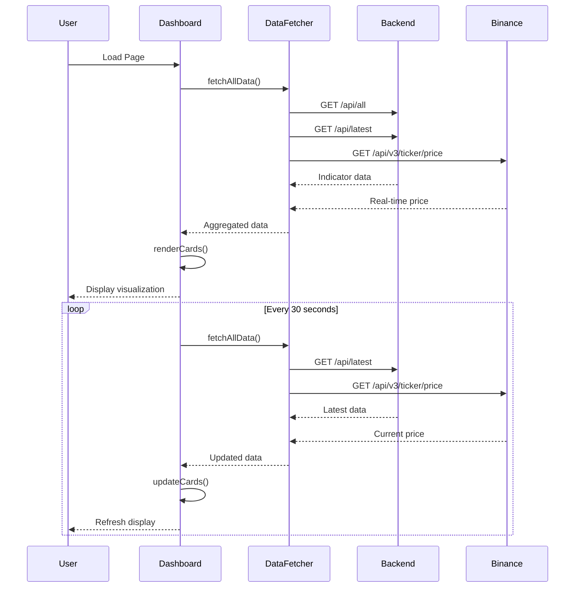

# Design Document: BTC Multi-Timeframe Dashboard

## Overview

### Purpose

The BTC Multi-Timeframe Dashboard is a web-based visualization interface that displays technical indicators across four timeframes (1m, 1w, 1d, 4h) using horizontal line representations. The dashboard enables investors to quickly compare indicator positions across timeframes to support multi-timeframe investment decisions.

### Key Design Decisions

1. **Horizontal Line Visualization**: Instead of traditional time-series charts, we use horizontal lines to show current indicator positions across timeframes. This design prioritizes cross-timeframe comparison over historical trends.

2. **3-Card Layout**: Indicators are grouped into three logical cards:
   - **Price/EMA/Bollinger Card**: Shows price levels, moving averages, and Bollinger Bands
   - **RSI Card**: Shows RSI14 and RSI6 with overbought/oversold zones
   - **MACD Card**: Shows DIF, DEA, and MACD histogram values

3. **SVG-Based Rendering**: We use SVG for horizontal line visualization due to:
   - Precise positioning and scaling capabilities
   - Native support for lines, labels, and markers
   - Better performance for static visualizations compared to Canvas
   - Easier styling and responsive behavior with CSS

4. **Vanilla JavaScript**: No framework dependencies to minimize complexity and load time. The existing codebase uses vanilla JS, maintaining consistency.

5. **Existing API Integration**: Leverages the existing FastAPI backend (`web/api.py`) with endpoints `/api/all` and `/api/latest`.

### Scope

**In Scope:**
- 3-card dashboard layout with responsive design
- Horizontal line visualization for indicators across 4 timeframes
- Color-coded indicator values (bullish/bearish, overbought/oversold)
- Real-time price display from Binance API
- Auto-refresh mechanism (30-second interval)
- Data fetching from existing FastAPI backend
- Error handling and loading states

**Out of Scope:**
- Historical trend charts (already exists in web/index.html)
- User authentication or personalization
- Alert/notification system
- Mobile-specific touch interactions
- Data export functionality
- Backend modifications (using existing API as-is)

---

## Architecture

### System Architecture

```mermaid
graph TB
    subgraph "Frontend (Browser)"
        A[HTML Page] --> B[Dashboard Controller]
        B --> C[Card Renderer]
        B --> D[Data Fetcher]
        C --> E[SVG Visualizer]
        C --> F[Value Formatter]
    end
    
    subgraph "Backend (FastAPI)"
        G[/api/all endpoint]
        H[/api/latest endpoint]
    end
    
    subgraph "External Services"
        I[Binance API]
    end
    
    subgraph "Database"
        J[(MySQL btc_assistant.klines)]
    end
    
    D -->|HTTP GET| G
    D -->|HTTP GET| H
    D -->|HTTP GET| I
    G --> J
    H --> J
    
    B -->|30s interval| D
```

### Component Architecture

The frontend follows a modular architecture with clear separation of concerns:

1. **Dashboard Controller**: Orchestrates data fetching, state management, and rendering
2. **Data Fetcher**: Handles all HTTP requests to backend and external APIs
3. **Card Renderer**: Manages the rendering of individual visualization cards
4. **SVG Visualizer**: Generates SVG elements for horizontal line visualizations
5. **Value Formatter**: Formats numeric values for display (prices, percentages, etc.)

### Data Flow



---

## Components and Interfaces

### 1. Dashboard Controller

**Responsibility**: Main orchestrator for the dashboard application.

**Interface**:
```javascript
class DashboardController {
  constructor(config) {
    // config: { apiBaseUrl, refreshInterval, timeframes }
  }
  
  async initialize() {
    // Initialize dashboard, fetch initial data, render cards
  }
  
  async refresh() {
    // Fetch latest data and update all cards
  }
  
  startAutoRefresh() {
    // Start 30-second auto-refresh timer
  }
  
  stopAutoRefresh() {
    // Stop auto-refresh timer
  }
}
```

**State Management**:
```javascript
{
  latestData: {
    '1m': { close, ema7, ema25, ema50, rsi14, rsi6, dif, dea, macd, boll_up, boll_md, boll_dn },
    '1w': { ... },
    '1d': { ... },
    '4h': { ... }
  },
  realtimePrice: { price, timestamp, direction },
  lastUpdate: timestamp,
  isLoading: boolean,
  error: string | null
}
```

### 2. Data Fetcher

**Responsibility**: Handle all HTTP requests and data aggregation.

**Interface**:
```javascript
class DataFetcher {
  constructor(apiBaseUrl) {}
  
  async fetchAllTimeframes() {
    // GET /api/all - returns historical data for all timeframes
    // Returns: { '1m': [...], '1w': [...], '1d': [...], '4h': [...] }
  }
  
  async fetchLatestValues() {
    // GET /api/latest - returns current values for all timeframes
    // Returns: { '1m': {...}, '1w': {...}, '1d': {...}, '4h': {...} }
  }
  
  async fetchRealtimePrice() {
    // GET Binance API - returns current BTC price
    // Returns: { price, timestamp }
  }
  
  async fetchAll() {
    // Parallel fetch of all data sources
    // Returns: { latest, realtime, timestamp }
  }
}
```

**Error Handling**:
- Network errors: Retry once, then display error message
- API errors: Display specific error message with troubleshooting steps
- Timeout: 10-second timeout for all requests

### 3. Card Renderer

**Responsibility**: Render individual visualization cards with horizontal lines.

**Interface**:
```javascript
class CardRenderer {
  constructor(containerId, cardConfig) {
    // cardConfig: { title, indicators, colorScheme, yAxisConfig }
  }
  
  render(data) {
    // Render card with horizontal lines for all timeframes
    // data: { '1m': {...}, '1w': {...}, '1d': {...}, '4h': {...} }
  }
  
  update(data) {
    // Update existing card with new data (smooth transition)
  }
  
  clear() {
    // Clear card content
  }
}
```

**Card Types**:

1. **Price/EMA/Bollinger Card**:
   - Indicators: close, ema7, ema25, ema50, boll_up, boll_md, boll_dn
   - Y-axis: Price scale (auto-calculated from min/max values)
   - Color scheme: Price (green/red), EMA (blue shades), Bollinger (red shades)

2. **RSI Card**:
   - Indicators: rsi14, rsi6
   - Y-axis: Fixed 0-100 scale
   - Reference lines: 30 (oversold), 70 (overbought)
   - Color scheme: Green (<30), Red (>70), Neutral (30-70)

3. **MACD Card**:
   - Indicators: dif, dea, macd
   - Y-axis: Auto-calculated from min/max values
   - Reference line: 0 (zero line)
   - Color scheme: Green (positive), Red (negative)

### 4. SVG Visualizer

**Responsibility**: Generate SVG elements for horizontal line visualizations.

**Interface**:
```javascript
class SVGVisualizer {
  constructor(svgElement, config) {
    // config: { width, height, padding, yAxisConfig }
  }
  
  drawHorizontalLine(y, label, color, style) {
    // Draw a horizontal line at y position with label
    // style: 'solid' | 'dashed' | 'dotted'
  }
  
  drawMarker(y, label, color, shape) {
    // Draw a marker (circle, triangle, etc.) at y position
    // shape: 'circle' | 'triangle' | 'square'
  }
  
  drawReferenceLine(y, label, color) {
    // Draw a reference line (e.g., RSI 30/70, MACD 0)
  }
  
  drawYAxis(min, max, ticks) {
    // Draw Y-axis with tick marks and labels
  }
  
  clear() {
    // Clear all SVG elements
  }
}
```

**SVG Structure**:
```xml
<svg width="100%" height="400" class="indicator-card-svg">
  <!-- Y-axis -->
  <g class="y-axis">
    <line x1="50" y1="0" x2="50" y2="400" stroke="#2a2d3a" />
    <text x="10" y="20">$70,000</text>
    <text x="10" y="200">$65,000</text>
    <text x="10" y="380">$60,000</text>
  </g>
  
  <!-- Reference lines (if applicable) -->
  <g class="reference-lines">
    <line x1="50" y1="100" x2="100%" y2="100" stroke="#444" stroke-dasharray="4,4" />
    <text x="60" y="95" fill="#888">70 (Overbought)</text>
  </g>
  
  <!-- Indicator lines grouped by timeframe -->
  <g class="timeframe-1m">
    <line x1="50" y1="150" x2="90%" y2="150" stroke="#22c55e" stroke-width="2" />
    <circle cx="95%" cy="150" r="4" fill="#22c55e" />
    <text x="60" y="145" fill="#e4e6f0">1m: $65,432</text>
  </g>
  
  <g class="timeframe-1w">
    <!-- Similar structure for 1w -->
  </g>
  
  <!-- ... other timeframes -->
</svg>
```

### 5. Value Formatter

**Responsibility**: Format numeric values for display.

**Interface**:
```javascript
class ValueFormatter {
  static formatPrice(value, decimals = 2) {
    // Format as price: $65,432.10
  }
  
  static formatPercentage(value, decimals = 1) {
    // Format as percentage: 65.4
  }
  
  static formatInteger(value) {
    // Format as integer with thousand separators: 1,234,567
  }
  
  static formatIndicator(value, type) {
    // Format based on indicator type (price, rsi, macd, etc.)
  }
  
  static formatTimestamp(timestamp) {
    // Format timestamp: "2024-01-20 14:30:00"
  }
}
```

**Formatting Rules** (from Requirements 10):
- Prices: 2 decimals, dollar sign, thousand separators ($65,432.10)
- MACD values: 0 decimals (123)
- RSI values: 1 decimal (65.4)
- Volume: 0 decimals, thousand separators (1,234,567)
- ATR: 0 decimals (456)

---

## Data Models

### Timeframe Data Model

```typescript
interface TimeframeData {
  timeframe: '1m' | '1w' | '1d' | '4h';
  timestamp: number;  // milliseconds
  close: number;
  volume: number;
  
  // Moving averages
  ema7: number | null;
  ema25: number | null;
  ema50: number | null;
  ema12: number | null;
  ma5: number | null;
  ma10: number | null;
  
  // MACD
  dif: number | null;
  dea: number | null;
  macd: number | null;
  
  // RSI
  rsi14: number | null;
  rsi6: number | null;
  
  // Bollinger Bands
  boll_up: number | null;
  boll_md: number | null;
  boll_dn: number | null;
  
  // Volatility
  atr: number | null;
}
```

### Dashboard State Model

```typescript
interface DashboardState {
  latestData: {
    [timeframe: string]: TimeframeData;
  };
  realtimePrice: {
    price: number;
    timestamp: number;
    direction: 'up' | 'down' | 'neutral';
  };
  lastUpdate: number;  // timestamp
  isLoading: boolean;
  error: string | null;
}
```

### Card Configuration Model

```typescript
interface CardConfig {
  id: string;
  title: string;
  indicators: IndicatorConfig[];
  yAxisConfig: YAxisConfig;
  colorScheme: ColorScheme;
}

interface IndicatorConfig {
  key: string;  // e.g., 'ema7', 'rsi14'
  label: string;  // e.g., 'EMA7', 'RSI(14)'
  color: string;  // hex color
  style: 'solid' | 'dashed' | 'dotted';
  markerShape?: 'circle' | 'triangle' | 'square';
}

interface YAxisConfig {
  type: 'auto' | 'fixed';
  min?: number;
  max?: number;
  ticks?: number;
  formatter: (value: number) => string;
}

interface ColorScheme {
  positive: string;  // green
  negative: string;  // red
  neutral: string;   // gray
  overbought: string;  // red
  oversold: string;    // green
}
```

### API Response Models

**GET /api/latest Response**:
```json
{
  "1m": {
    "close": 65432.10,
    "volume": 1234567,
    "ema7": 65500.00,
    "ema25": 65000.00,
    "ema50": 64500.00,
    "dif": 123.45,
    "dea": 100.00,
    "macd": 23.45,
    "rsi14": 65.4,
    "rsi6": 70.2,
    "boll_up": 66000.00,
    "boll_md": 65000.00,
    "boll_dn": 64000.00,
    "atr": 456.78
  },
  "1w": { /* ... */ },
  "1d": { /* ... */ },
  "4h": { /* ... */ }
}
```

**Binance API Response**:
```json
{
  "symbol": "BTCUSDT",
  "price": "65432.10"
}
```

---

## Error Handling

### Error Categories

1. **Network Errors**
   - Connection timeout
   - DNS resolution failure
   - Network unreachable

2. **API Errors**
   - Backend not running (connection refused)
   - Invalid response format
   - Missing data fields
   - HTTP error codes (4xx, 5xx)

3. **Data Errors**
   - Null or undefined indicator values
   - Invalid numeric values (NaN, Infinity)
   - Timestamp parsing errors

4. **Rendering Errors**
   - SVG generation failures
   - DOM manipulation errors
   - Invalid color values

### Error Handling Strategy

**Network Errors**:
```javascript
async function fetchWithRetry(url, retries = 1) {
  try {
    const response = await fetch(url, { timeout: 10000 });
    if (!response.ok) {
      throw new Error(`HTTP ${response.status}: ${response.statusText}`);
    }
    return await response.json();
  } catch (error) {
    if (retries > 0) {
      console.warn(`Fetch failed, retrying... (${retries} attempts left)`);
      await sleep(1000);
      return fetchWithRetry(url, retries - 1);
    }
    throw error;
  }
}
```

**API Errors**:
- Display user-friendly error message in dashboard
- Include troubleshooting steps (e.g., "Please start backend: uvicorn web.api:app --reload")
- Log detailed error to console for debugging

**Data Errors**:
- Display "—" placeholder for null/undefined values
- Skip rendering for invalid numeric values
- Log warning to console

**Rendering Errors**:
- Catch and log errors during SVG generation
- Display fallback text: "Visualization unavailable"
- Continue rendering other cards

### Error Display

```html
<div class="error-message">
  <div class="error-icon">⚠️</div>
  <div class="error-title">Unable to load data</div>
  <div class="error-details">
    Failed to connect to backend API. Please ensure the backend is running:
    <code>uvicorn web.api:app --reload</code>
  </div>
  <button onclick="retry()">Retry</button>
</div>
```

---

## Testing Strategy

### Testing Approach

This feature is primarily a **UI visualization and data presentation layer** with the following characteristics:
- Fetches data from existing APIs (no complex business logic)
- Renders SVG visualizations based on data
- Formats and displays numeric values
- Handles UI interactions (refresh, responsive layout)

**Property-based testing is NOT appropriate** for this feature because:
1. **UI Rendering**: SVG generation and DOM manipulation are side-effect operations with no pure function outputs to test
2. **External Dependencies**: Data comes from external APIs (backend, Binance) - behavior doesn't vary meaningfully with generated inputs
3. **Visual Presentation**: Color coding and layout are visual concerns best tested with snapshot tests or manual review
4. **Simple Data Transformation**: Value formatting is deterministic with specific examples, not universal properties

### Testing Strategy

We will use **example-based unit tests** and **integration tests**:

#### 1. Unit Tests

**Value Formatter Tests**:
```javascript
describe('ValueFormatter', () => {
  test('formatPrice with 2 decimals and thousand separators', () => {
    expect(ValueFormatter.formatPrice(65432.10)).toBe('$65,432.10');
    expect(ValueFormatter.formatPrice(1234567.89)).toBe('$1,234,567.89');
  });
  
  test('formatPrice handles null values', () => {
    expect(ValueFormatter.formatPrice(null)).toBe('—');
    expect(ValueFormatter.formatPrice(undefined)).toBe('—');
  });
  
  test('formatPercentage with 1 decimal', () => {
    expect(ValueFormatter.formatPercentage(65.432)).toBe('65.4');
    expect(ValueFormatter.formatPercentage(70.0)).toBe('70.0');
  });
  
  test('formatInteger with thousand separators', () => {
    expect(ValueFormatter.formatInteger(1234567)).toBe('1,234,567');
    expect(ValueFormatter.formatInteger(0)).toBe('0');
  });
});
```

**Color Coding Logic Tests**:
```javascript
describe('ColorCoding', () => {
  test('EMA color based on price position', () => {
    expect(getEMAColor(65000, 64000)).toBe('green');  // price above EMA
    expect(getEMAColor(65000, 66000)).toBe('red');    // price below EMA
  });
  
  test('RSI color based on overbought/oversold', () => {
    expect(getRSIColor(75)).toBe('red');     // overbought
    expect(getRSIColor(25)).toBe('green');   // oversold
    expect(getRSIColor(50)).toBe('neutral'); // neutral
  });
  
  test('MACD color based on positive/negative', () => {
    expect(getMACDColor(123.45)).toBe('green');  // positive
    expect(getMACDColor(-50.00)).toBe('red');    // negative
    expect(getMACDColor(0)).toBe('neutral');     // zero
  });
});
```

**Data Validation Tests**:
```javascript
describe('DataValidator', () => {
  test('validates timeframe data structure', () => {
    const validData = {
      timeframe: '1m',
      close: 65000,
      ema7: 65500,
      rsi14: 65.4
    };
    expect(DataValidator.isValid(validData)).toBe(true);
  });
  
  test('handles missing indicator values', () => {
    const dataWithNulls = {
      timeframe: '1m',
      close: 65000,
      ema7: null,
      rsi14: undefined
    };
    expect(DataValidator.isValid(dataWithNulls)).toBe(true);
  });
  
  test('rejects invalid numeric values', () => {
    const invalidData = {
      timeframe: '1m',
      close: NaN,
      ema7: Infinity
    };
    expect(DataValidator.isValid(invalidData)).toBe(false);
  });
});
```

#### 2. Integration Tests

**API Integration Tests**:
```javascript
describe('DataFetcher Integration', () => {
  test('fetches latest values from backend', async () => {
    const fetcher = new DataFetcher('http://127.0.0.1:8000');
    const data = await fetcher.fetchLatestValues();
    
    expect(data).toHaveProperty('1m');
    expect(data).toHaveProperty('1w');
    expect(data).toHaveProperty('1d');
    expect(data).toHaveProperty('4h');
    expect(data['1m']).toHaveProperty('close');
    expect(typeof data['1m'].close).toBe('number');
  });
  
  test('fetches realtime price from Binance', async () => {
    const fetcher = new DataFetcher('http://127.0.0.1:8000');
    const price = await fetcher.fetchRealtimePrice();
    
    expect(price).toHaveProperty('price');
    expect(typeof price.price).toBe('number');
    expect(price.price).toBeGreaterThan(0);
  });
  
  test('handles backend connection failure', async () => {
    const fetcher = new DataFetcher('http://localhost:9999');  // wrong port
    await expect(fetcher.fetchLatestValues()).rejects.toThrow();
  });
});
```

**End-to-End Tests** (using Playwright or Cypress):
```javascript
describe('Dashboard E2E', () => {
  test('loads and displays all 3 cards', async () => {
    await page.goto('http://localhost:8000/dashboard.html');
    
    // Wait for data to load
    await page.waitForSelector('.card', { timeout: 5000 });
    
    // Verify 3 cards are displayed
    const cards = await page.$$('.card');
    expect(cards.length).toBe(3);
    
    // Verify card titles
    const titles = await page.$$eval('.card-title', els => els.map(el => el.textContent));
    expect(titles).toContain('Price & Moving Averages');
    expect(titles).toContain('RSI Indicators');
    expect(titles).toContain('MACD Indicators');
  });
  
  test('displays realtime price in header', async () => {
    await page.goto('http://localhost:8000/dashboard.html');
    await page.waitForSelector('.realtime-price');
    
    const priceText = await page.textContent('.realtime-price');
    expect(priceText).toMatch(/\$[\d,]+\.\d{2}/);  // matches $65,432.10 format
  });
  
  test('auto-refresh updates data', async () => {
    await page.goto('http://localhost:8000/dashboard.html');
    await page.waitForSelector('.realtime-price');
    
    const initialPrice = await page.textContent('.realtime-price');
    
    // Wait for auto-refresh (30 seconds)
    await page.waitForTimeout(31000);
    
    const updatedPrice = await page.textContent('.realtime-price');
    // Price may or may not change, but timestamp should update
    const timestamp = await page.textContent('#updateTime');
    expect(timestamp).toMatch(/更新于/);
  });
  
  test('manual refresh button works', async () => {
    await page.goto('http://localhost:8000/dashboard.html');
    await page.waitForSelector('.refresh-btn');
    
    const initialTimestamp = await page.textContent('#updateTime');
    
    await page.click('.refresh-btn');
    await page.waitForTimeout(1000);
    
    const updatedTimestamp = await page.textContent('#updateTime');
    expect(updatedTimestamp).not.toBe(initialTimestamp);
  });
});
```

#### 3. Visual Regression Tests

Use snapshot testing for SVG visualizations:
```javascript
describe('SVG Visualization Snapshots', () => {
  test('Price card SVG matches snapshot', () => {
    const mockData = {
      '1m': { close: 65000, ema7: 65500, ema25: 65000, ema50: 64500 },
      '1w': { close: 64000, ema7: 64500, ema25: 64000, ema50: 63500 },
      '1d': { close: 65500, ema7: 66000, ema25: 65500, ema50: 65000 },
      '4h': { close: 65200, ema7: 65700, ema25: 65200, ema50: 64700 }
    };
    
    const card = new CardRenderer('price-card', priceCardConfig);
    card.render(mockData);
    
    const svg = document.querySelector('#price-card svg');
    expect(svg).toMatchSnapshot();
  });
});
```

#### 4. Manual Testing Checklist

- [ ] All 3 cards display correctly on desktop (>1200px width)
- [ ] Cards stack vertically on mobile (<700px width)
- [ ] Horizontal lines are positioned correctly relative to Y-axis
- [ ] Color coding matches requirements (green/red for bullish/bearish)
- [ ] RSI overbought/oversold zones are highlighted correctly
- [ ] MACD zero line is displayed
- [ ] Realtime price updates and shows direction arrows
- [ ] Auto-refresh works every 30 seconds
- [ ] Manual refresh button works
- [ ] Error message displays when backend is not running
- [ ] Loading state displays during initial data fetch
- [ ] Null values display as "—" placeholder
- [ ] Number formatting matches requirements (decimals, thousand separators)

### Test Coverage Goals

- **Unit Tests**: 80%+ coverage for utility functions (formatters, validators, color logic)
- **Integration Tests**: Cover all API endpoints and error scenarios
- **E2E Tests**: Cover critical user flows (load dashboard, refresh, responsive layout)
- **Visual Tests**: Snapshot tests for all 3 card types

### Testing Tools

- **Unit Tests**: Jest or Vitest
- **Integration Tests**: Jest with fetch mocks
- **E2E Tests**: Playwright or Cypress
- **Visual Regression**: Percy or Chromatic (optional)

---

## Implementation Notes

### File Structure

```
web/
├── dashboard.html          # Main dashboard page
├── dashboard.css           # Styles for dashboard
├── dashboard.js            # Main JavaScript logic
├── components/
│   ├── DashboardController.js
│   ├── DataFetcher.js
│   ├── CardRenderer.js
│   ├── SVGVisualizer.js
│   └── ValueFormatter.js
└── api.py                  # Existing FastAPI backend (no changes)
```

### Performance Considerations

1. **SVG Optimization**:
   - Limit number of elements per card (<100 elements)
   - Use CSS classes instead of inline styles
   - Debounce window resize events for responsive updates

2. **Data Fetching**:
   - Use `Promise.all()` for parallel API requests
   - Implement request caching (30-second TTL)
   - Cancel pending requests on page unload

3. **Rendering**:
   - Use `requestAnimationFrame()` for smooth updates
   - Batch DOM updates to minimize reflows
   - Lazy-load cards below the fold (if needed)

### Browser Compatibility

- **Target Browsers**: Chrome 90+, Firefox 88+, Safari 14+, Edge 90+
- **Required Features**: Fetch API, ES6 modules, SVG 1.1, CSS Grid
- **Polyfills**: None required for target browsers

### Accessibility

- **ARIA Labels**: Add `aria-label` to SVG elements for screen readers
- **Keyboard Navigation**: Ensure refresh button is keyboard accessible
- **Color Contrast**: Ensure text meets WCAG AA standards (4.5:1 ratio)
- **Focus Indicators**: Visible focus outlines for interactive elements

### Responsive Design Breakpoints

- **Desktop**: >1200px - 3-column grid
- **Tablet**: 700px-1200px - 2-column grid
- **Mobile**: <700px - 1-column stack

### Color Palette

```css
:root {
  --bg: #0f1117;
  --card: #1a1d28;
  --border: #2a2d3a;
  --text: #e4e6f0;
  --text-dim: #8a8fa8;
  --green: #22c55e;
  --red: #ef4444;
  --gold: #f59e0b;
  --blue: #3b82f6;
  --purple: #a855f7;
}
```

### Development Workflow

1. **Setup**: Start backend with `uvicorn web.api:app --reload`
2. **Development**: Open `web/dashboard.html` in browser
3. **Testing**: Run `npm test` for unit tests
4. **E2E Testing**: Run `npm run test:e2e` for end-to-end tests
5. **Build**: No build step required (vanilla JS)

---

## Future Enhancements

1. **Historical Comparison**: Add ability to compare current values with previous periods
2. **Custom Timeframes**: Allow users to select custom timeframes
3. **Alert Thresholds**: Visual indicators when RSI crosses 30/70 or MACD crosses zero
4. **Export**: Export current indicator values as CSV or JSON
5. **Themes**: Light/dark theme toggle
6. **Mobile Gestures**: Swipe to refresh on mobile devices
7. **WebSocket**: Real-time updates via WebSocket instead of polling
8. **Annotations**: Allow users to add notes to specific indicator levels

---

## References

- [BTC Multi-Timeframe Investment Framework](../../frameworks/BTC多时间周期投资框架.md)
- [Existing Dashboard Implementation](../../web/index.html)
- [FastAPI Backend](../../web/api.py)
- [Requirements Document](./requirements.md)
- [SVG Specification](https://www.w3.org/TR/SVG11/)
- [Binance API Documentation](https://binance-docs.github.io/apidocs/spot/en/)
